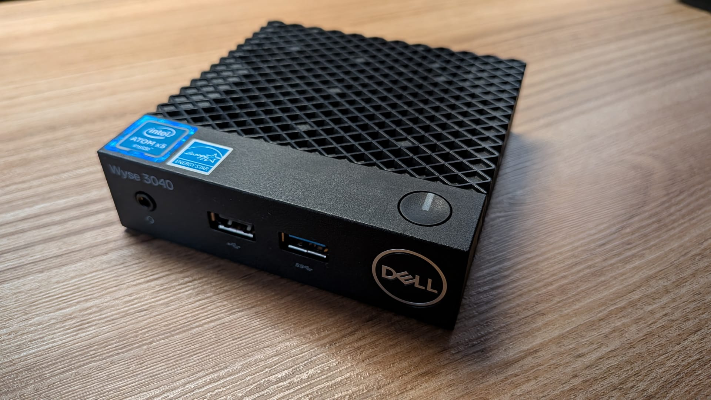
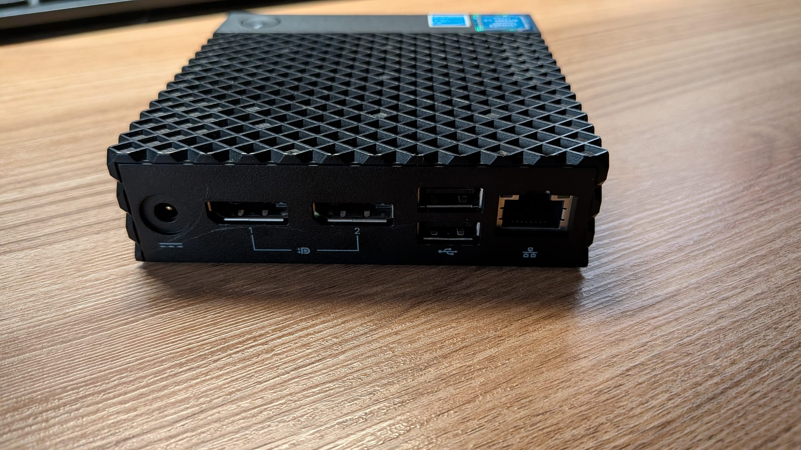

[](https://buymeacoffee.com/alexmilla)

# Wyse 3040 — ISO de despliegue (Debian 13 + XFCE + AdGuard Home)

ISO de Clonezilla Live **desatendida** que convierte un Dell Wyse 3040 en un **servidor DNS local con AdGuard Home**, con Debian 13 y escritorio XFCE ya instalados y configurados. Arrancas el USB, esperas, y el equipo queda desplegado. Pensada para que una persona sin conocimientos técnicos pueda hacerlo sin ayuda.

> ⚠️ **ESTA ISO BORRA EL DISCO** del equipo en el que se arranque (restauración por lotes al eMMC `/dev/mmcblk0`). Úsala solo en un Wyse 3040 compatible. Sin confirmaciones: al arrancar, restaura y se reinicia sola.

## ❓ ¿Por qué he creado este proyecto?

Este proyecto se me ocurrió gracias a un vecino que muchas veces se queja de que, mientras navega o ve un vídeo, no paran de salirle anuncios. Entonces recordé que en un trabajo anterior utilicé los Wyse 3040 como *thin clients* y lo poco que consumían.

El Dell Wyse 3040 es un *thin client* ultracompacto —el más pequeño y ligero de Dell—, sin ventilador y totalmente silencioso. Monta un Intel Atom x5-Z8350 de cuatro núcleos a 1,44 GHz (hasta 1,92 GHz en turbo), 2 o 4 GB de RAM DDR3L y 8 o 16 GB de almacenamiento eMMC, con Gigabit Ethernet, Wi-Fi 5, Bluetooth 4.2, cuatro puertos USB (uno de ellos 3.0) y dos DisplayPort. Y lo más importante para este uso: funciona con un adaptador de apenas **15 W**, así que puede estar encendido 24/7 sin que se note en la factura de la luz.

Además, al haber salido al mercado de segunda mano en grandes volúmenes de descarte empresarial, en eBay y otras plataformas se encuentran por **apenas unas decenas de euros**: muy poca inversión para un servidor DNS eficiente y silencioso.

AdGuard Home también requiere pocos recursos, así que pensé que podría ser una buena idea echarle un cable. También es aprovechable para padres que quieren tener un poco de control parental sobre los dispositivos de sus hijos, ya que AdGuard Home lo permite e incluso da la posibilidad de crear listas personalizadas de URLs bloqueadas.

No es necesario un gran desembolso ni tener un equipo que consuma mucha energía para tener un servicio así de eficiente.

## 💡 De qué va este proyecto

**Qué es:** una instalación completa de **Debian 13** (hecha desde la imagen *netinst* oficial) con escritorio **XFCE** —ligero, ideal para hardware modesto— y **AdGuard Home** como **DNS local**: todo el tráfico DNS de la red doméstica pasa por este equipo, filtrando publicidad y rastreadores para todos los dispositivos conectados, sin instalar nada en ellos.

**Por qué un Wyse 3040:** es un *thin client* fanless de tamaño diminuto, silencioso y con un **consumo eléctrico realmente bajo**, que funciona 24/7 sin problema. Además, los **precios de segunda mano son muy baratos**: por poco más que nada tienes hardware x86 silencioso y eficiente para hacer de servidor DNS doméstico.

   |  |
 |---|---|

**Cómo funciona el reparto:** la instalación maestra se capturó como imagen de disco con Clonezilla y se empaquetó en una ISO de recuperación desatendida. Quien reciba la ISO solo necesita un USB y 15 minutos para clonar esa misma instalación en otro Wyse 3040, sin instalar nada ni saber Linux.

## 📥 Descarga

- **ISO (2,1 GiB):** [clonezilla-live-WYSE3040-DEBIAN13-ADGUARD.iso (Google Drive)](https://drive.google.com/file/d/1eEKf1X5x_vkQI6hOqPlZiYi0EsVJI0ee/view?usp=drive_link)
- **SHA256:** `32fc3f9ad5ac068c5e96451d30ac98b2027293fe0135baf68337fb6312f59c5d`

Verifica en Windows: `certutil -hashfile descarga.iso SHA256` · en Linux/macOS: `sha256sum descarga.iso`

## 🚀 Cómo se despliega (resumen)

1. Descarga la ISO.
2. Grábala en un USB de ≥8 GB con [Rufus](https://rufus.ie) (GPT/UEFI, modo Imagen ISO).
3. Arranca el Wyse 3040 con F12 → entrada UEFI del USB.
4. No toques nada: restaura en 5–10 min y se reinicia solo.

## 📦 Qué contiene la imagen

| Componente | Detalle |
|---|---|
| Debian 13 (estable) | Instalada desde la imagen *netinst* oficial |
| Escritorio XFCE | Ligero, adecuado para el hardware del thin client |
| AdGuard Home | DNS local activo y configurado para filtrar la red |
| Idioma y teclado | En español |
| Red | IP por **DHCP** (sin IP fija: cada cual la adapta a su red) |
| Hardware objetivo | Dell Wyse 3040 (eMMC 16 GB) |

La ISO incluye su propio entorno de restauración: no requiere internet ni nada instalado en el equipo destino.

## ⚙️ Configuración tras el despliegue

La imagen **no lleva IP fija asignada: la IP se obtiene por DHCP**, para que puedas ajustar el servicio a la IP libre que tengas disponible en tu red.

Una vez el Wyse esté encendido y conectado por cable, localiza la IP que le ha asignado tu router (p. ej., en la lista de dispositivos de tu router). **Esa IP es la que tendrás que poner como servidor DNS en los ajustes de la tarjeta de red de tus dispositivos** (Ethernet o Wi-Fi), o directamente en el router para que el filtrado se aplique a toda la casa. A partir de ahí, AdGuard Home empieza a filtrar el tráfico DNS de todo lo que conectes a él.

> 💡 **Consejo:** si quieres que la IP no cambie nunca, en vez de tocar nada en el Debian basta con pedirle al router una *reserva DHCP* para el Wyse: la IP queda fija sin reconfigurar el servicio.

## 👤 Usuarios por defecto de la imagen

Todas las unidades desplegadas salen con las mismas credenciales:

- **Debian** (inicio de sesión): usuario `adguard`, contraseña `Adguard01$`
- **AdGuard Home** (interfaz web, puerto 3000): usuario `adguard`, contraseña `Adguard01$`

La interfaz web de AdGuard Home está disponible en `http://IP-DEL-WYSE:3000`.

> 🔐 **Se recomienda cambiar las contraseñas por defecto una vez esté configurado tu dispositivo** — todas las unidades desplegadas comparten estas mismas credenciales. En Debian se cambia desde una terminal con `passwd`; en AdGuard Home, desde *Ajustes → Autenticación*.

## 🔧 Cómo se fabricó (reproducible)

Para quien quiera regenerarla a partir de su propia instalación:

1. **Crear la imagen** con Clonezilla Live: *savedisk* de `mmcblk0` → imagen `WYSE3040-DEBIAN13-ADGUARD` guardada en un USB.
2. **Generar la ISO desatendida**, arrancando Clonezilla en modo shell:

```bash
mount /dev/sdb1 /home/partimag
cd /home/partimag
ocs-iso -g en_US.UTF-8 -t -k NONE \
  -e "-g auto -b -c -p reboot restoredisk WYSE3040-DEBIAN13-ADGUARD mmcblk0" \
  WYSE3040-DEBIAN13-ADGUARD
```

La ISO resultante arranca en modo batch (sin preguntas), restaura y reinicia (`-b -c -p reboot`).

## ⚖️ Licencias y créditos

- [Clonezilla](https://clonezilla.org) — GPL v2. Su inclusión en la ISO es la forma prevista por el proyecto de crear *"Recovery Clonezilla Live"*.
- [Debian GNU/Linux](https://www.debian.org) — software libre (varias licencias libres).
- AdGuard Home — GPL v3.
- Esta ISO se distribuye libremente tal cual, sin garantía alguna. Haz siempre copia de los datos del equipo destino antes de arrancarla.

## ☕ Invítame a un café

Si este proyecto te ha sido útil y quieres apoyarlo, puedes hacer una pequeña donación en **Buy Me a Coffee**:

👉 [buymeacoffee.com/alexmilla](https://www.buymeacoffee.com/alexmilla)

Cualquier aportación, por pequeña que sea, ayuda a mantener el proyecto. ¡Gracias!


## 📬 Contact

- Website: [alexmilla.dev](https://alexmilla.dev)
- GitHub: [github.com/alex-milla](https://github.com/alex-milla)
- Support: [buymeacoffee.com/alexmilla](https://buymeacoffee.com/alexmilla)
